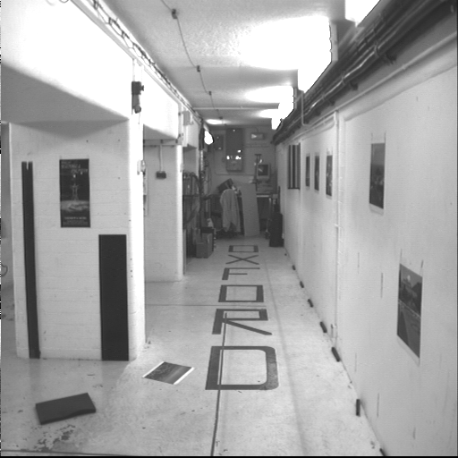
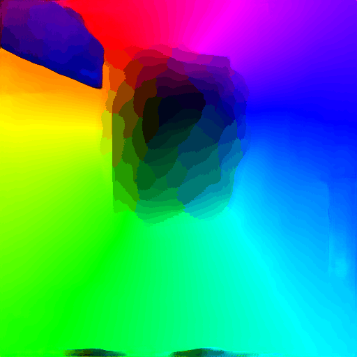
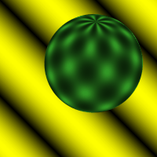
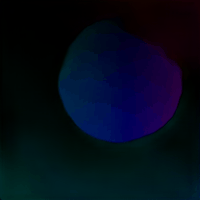
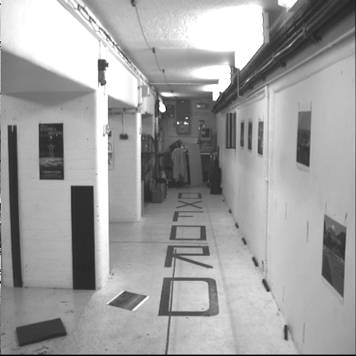
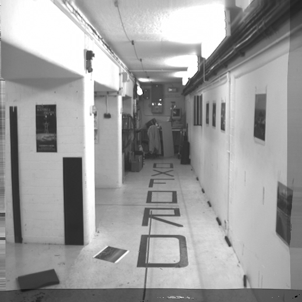
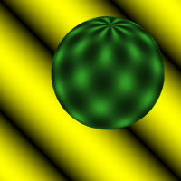
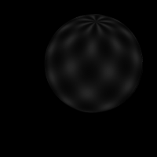

  [![Contributors][contributors-shield]][contributors-url] [![Forks][forks-shield]][forks-url] [![Stargazers][stars-shield]][stars-url] [![Issues][issues-shield]][issues-url] [![MIT License][license-shield]][license-url] [![LinkedIn][linkedin-shield]][linkedin-url]

<!-- PROJECT LOGO -->
<br />

<p align="center">
  <h3 align="center">Video Interpolation using Deep Optical Flow</h3>
  <p align="center">
    Intermediate frame interpolation using optical flow with FlowNet2
    <br />
    <a href=https://github.com/vineeths96/Video-Interpolation-using-Deep-Optical-Flow><strong>Explore the repository»</strong></a>
    <br />
    <br />
    <a href=https://github.com/vineeths96/Video-Interpolation-using-Deep-Optical-Flow/blob/master/Problem_Statement.pdf>View Problem Statement</a>
    <a href=https://github.com/vineeths96/Video-Interpolation-using-Deep-Optical-Flow/blob/master/results/report.pdf>View Report</a>
  </p>

</p>

> tags : frame interpolation, optical flow, flownet2, digital video, deep learning, pytorch


<!-- ABOUT THE PROJECT -->

## About The Project

This project deals with the task of video frame interpolation with estimated optical flow. In particular, we estimate the forward optical flow (flow from Frame *N* to Frame *N + 2*) and the backward
flow (flow from Frame *N + 2* to Frame *N*) and use both of them to estimate the intermediate Frame *N*. To estimate the optical flow we use pre-trained [FlowNet2](https://github.com/NVIDIA/flownet2-pytorch) deep learning model and experiment by fine-tuning it. We explore the interpolation performance on [Spheres](./input/sphere) dataset and [Corridor](./input/corridor) dataset.  We observe that the quality of interpolated frames is comparable to original with both the datasets. A detailed description of interpolation algorithms, loss functions, analysis of the results are available in the [Report](./results/report.pdf).

Note: [flownet](./flownet2) folder contains code modified from [NVIDIA FlowNet2](https://github.com/NVIDIA/flownet2-pytorch) Repository and [FlowNet2 PyTorch Wrapper](https://github.com/ErenBalatkan/FlowNet2-PyTorch-EasyToUse-Wrapper). Download the pre-trained models and put it in `./flownet2/pretrained_models` folder.

### Built With
This project was built with 

* python v3.7
* pytorch v1.0.0
* The environment used for developing this project is available at [environment.yml](environment.yml).


<!-- GETTING STARTED -->

## Getting Started

Clone the repository into a local machine using

```shell
git clone https://github.com/vineeths96/Video-Interpolation-using-Deep-Optical-Flow
```

### Prerequisites

Create a new conda environment and install all the libraries by running the following command

```shell
conda env create -f environment.yml
```

The dataset used in this project is already available in this repository. To test on other datasets, download them and put them in the `input/` folder.

### Instructions to run

We explore with pre-trained [FlowNet2](https://github.com/NVIDIA/flownet2-pytorch) model from NVIDIA and experiment by fine-tuning it. 

##### Pre-trained FlowNet2 model

To interpolate the frame with the pretrained FlowNet2 model, run the following command. This will interpolate the intermediate frames and store it in [this](./results/pretrained/interpolated_frames) folder.

```shell
python pretrained_interpolation.py
```

##### FlowNet2 with fine-tuning

To interpolate the frame with the pretrained FlowNet2 model, run the following command. Set the parameters for fine-tuning in the [parameters](./finetuned/parameters.py) file. This will interpolate the intermediate frames and store it in [this](./results/finetuned/interpolated_frames) folder.

```shell
python finetuned_interpolation.py
```


<!-- RESULTS -->

## Results

**Note that the GIFs below might not be in sync depending on the network quality. Clone the repository to your local machine and open them locally to see them in sync.**


A detailed description of algorithms and analysis of the results are available in the [Report](./results/report.pdf).

The plots below shows the estimated optical flow for the datasets with the pre-trained model and the fine-tuned model. We can see that there are no significant change in the estimated optical flow between the two methods.

|             Corridor Dataset             |               Pre-Trained Optical Flow                |               Fine-Tuned Optical Flow                |
| :--------------------------------------: | :---------------------------------------------------: | :--------------------------------------------------: |
|  |  |  |

|            Sphere Dataset            |             Pre-Trained Optical Flow              |             Fine-Tuned Optical Flow              |
| :----------------------------------: | :-----------------------------------------------: | :----------------------------------------------: |
|  |  |  |


The plots below shows the interpolated frames for the datasets with the pre-trained model and the fine-tuned model. We can see that there is no significant change in quality of interpolated frames between the two methods.

|             Corridor Dataset Ground Truth             |                Pre-Trained Interpolated Frame                |                Fine-Tuned Interpolated Frame                 |
| :---------------------------------------------------: | :----------------------------------------------------------: | :----------------------------------------------------------: |
|  |  |  |

|            Sphere Dataset Ground Truth            |                Pre-Trained Interpolated Frame                |                Fine-Tuned Interpolated Frame                 |
| :-----------------------------------------------: | :----------------------------------------------------------: | :----------------------------------------------------------: |
|  |  |  |


<!-- LICENSE -->

## License

Distributed under the MIT License. See `LICENSE` for more information.


<!-- CONTACT -->
## Contact

Vineeth S - vs96codes@gmail.com

Project Link: [https://github.com/vineeths96/Video-Interpolation-using-Deep-Optical-Flow](https://github.com/vineeths96/Video-Interpolation-using-Deep-Optical-Flow)


<!-- ACKNOWLEDGEMENTS -->
## Acknowledgements

* [NVIDIA FlowNet2](https://github.com/NVIDIA/flownet2-pytorch)

  > Fitsum Reda et al. flownet2-pytorch: Pytorch implementation of FlowNet 2.0: Evolution of Optical Flow Estimation
  > with Deep Networks. https://github.com/NVIDIA/flownet2-pytorch . 2017.


<!-- MARKDOWN LINKS & IMAGES -->
<!-- https://www.markdownguide.org/basic-syntax/#reference-style-links -->

[contributors-shield]: https://img.shields.io/github/contributors/vineeths96/Video-Interpolation-using-Deep-Optical-Flow.svg?style=flat-square
[contributors-url]: https://github.com/vineeths96/Video-Interpolation-using-Deep-Optical-Flow/graphs/contributors
[forks-shield]: https://img.shields.io/github/forks/vineeths96/Video-Interpolation-using-Deep-Optical-Flow.svg?style=flat-square
[forks-url]: https://github.com/vineeths96/Video-Interpolation-using-Deep-Optical-Flow/network/members
[stars-shield]: https://img.shields.io/github/stars/vineeths96/Video-Interpolation-using-Deep-Optical-Flow.svg?style=flat-square
[stars-url]: https://github.com/vineeths96/Video-Interpolation-using-Deep-Optical-Flow/stargazers
[issues-shield]: https://img.shields.io/github/issues/vineeths96/Video-Interpolation-using-Deep-Optical-Flow.svg?style=flat-square
[issues-url]: https://github.com/vineeths96/Video-Interpolation-using-Deep-Optical-Flow/issues
[license-shield]: https://img.shields.io/badge/License-MIT-yellow.svg
[license-url]: https://github.com/vineeths96/Video-Interpolation-using-Deep-Optical-Flow/blob/master/LICENSE
[linkedin-shield]: https://img.shields.io/badge/-LinkedIn-black.svg?style=flat-square&logo=linkedin&colorB=555
[linkedin-url]: https://linkedin.com/in/vineeths

